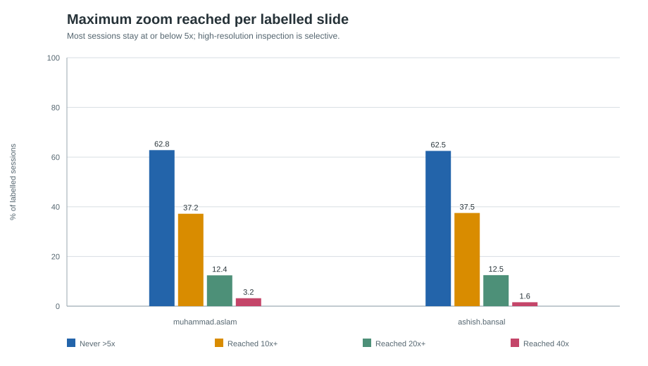
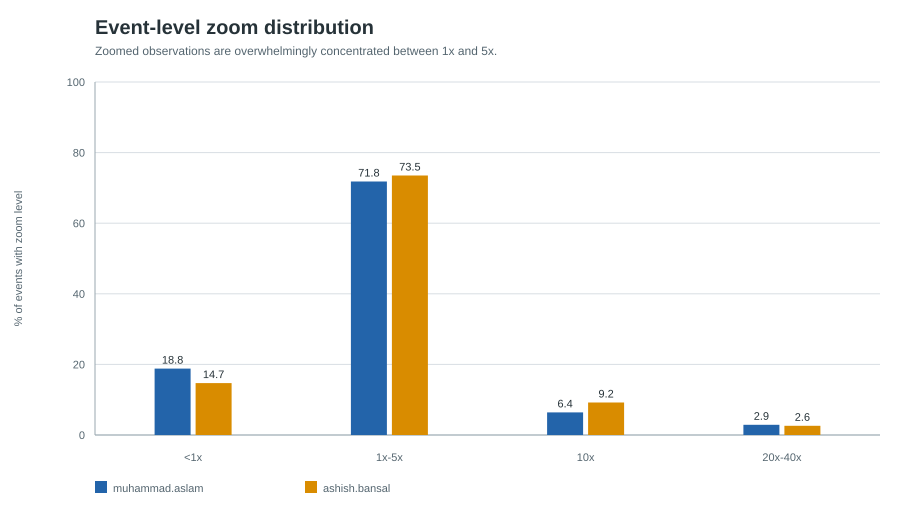
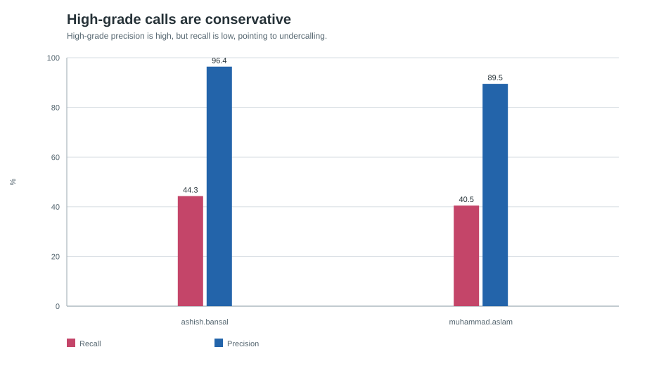
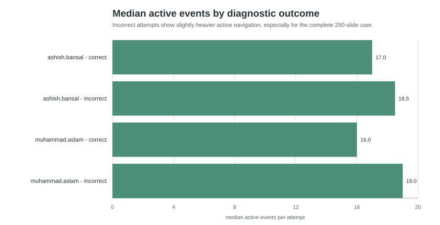
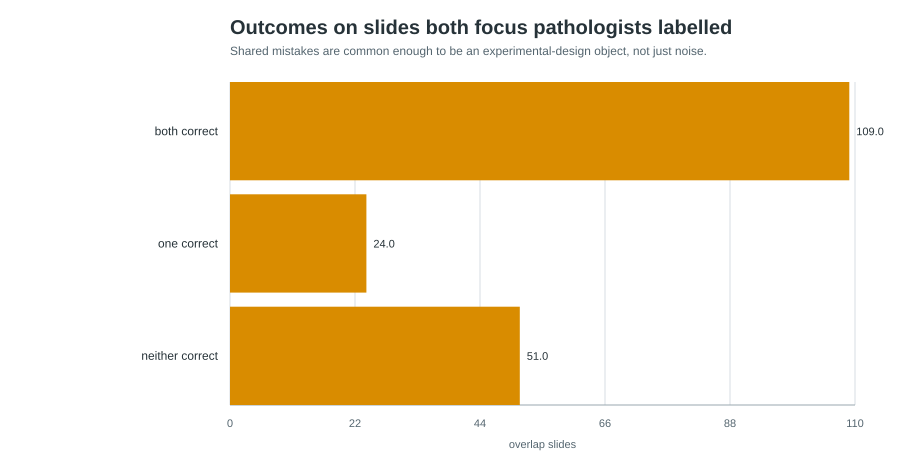

# Adaptive Reading Exploratory Analysis

## Executive Summary

- **The two focus pathologists provide enough telemetry for a behaviour-first paper spine.** `muhammad.aslam` completed 250 labelled slides and `ashish.bansal` labelled 184 slides, together contributing the large majority of exported events in `pathology_events_2026-06-16.csv`.
- **The strongest architecture signal is selective high-resolution use.** Both observers have a median maximum zoom of 5x; about 63% of labelled sessions never go above 5x, and only about 12% reach 20x or higher. This supports a coarse-to-fine/adaptive reading design rather than whole-slide full-resolution processing.
- **The sharpest diagnostic signal is high-grade undercalling.** High-grade precision is very high, but high-grade recall is low. When a pathologist calls high-grade they are usually right, but many ground-truth high-grade slides are called low-grade.
- **Observer agreement is high, but shared wrongness is the useful anomaly.** On 184 overlap slides, the two focus pathologists agree on 160, but both are wrong on 51. Those shared-error slides should be treated as an experimental object, not washed out as label noise.

## Data And Method

Source: `pathology_events_2026-06-16.csv`, used as the controlling source for this round. The live PostgreSQL database was intentionally not required.

Diagnosis is derived per user-slide session as the last non-empty label event in timestamp order. Timing and navigation intensity are derived per viewing attempt because the application keeps one session per user-slide and can record repeated openings through `viewing_attempt`.

Canonical time metrics are `idle_adjusted_duration_s` and `gap_capped_duration_s`. Raw duration is retained for audit only because explicit idle spans show that breaks can inflate raw session time by minutes or hours.

## Cohort Snapshot

| Pathologist | Labelled slides | Accuracy | Never >5x | Reached 20x+ | Median active events | Median active seconds |
| --- | --- | --- | --- | --- | --- | --- |
| muhammad.aslam | 250 | 65.2% | 62.8% | 12.4% | 17 | 18 |
| ashish.bansal | 184 | 67.9% | 62.5% | 12.5% | 18 | 29 |

## Low Magnification Dominates The Viewing Strategy

Most labelled sessions never exceed 5x, while 20x and 40x use is rare. That is exactly the kind of behavioural fact that can justify an architecture that first reasons at low/mid magnification, then selectively asks for high-resolution evidence only when needed.

At the event level, the same pattern holds. The 1x-5x band contains the bulk of zoomed observations for both users; high-resolution observations are a small minority rather than the normal operating mode.

**Architecture implication:** use pathologist behaviour to constrain a coarse-to-fine model. A natural first experiment is to compare full-slide or dense patch baselines against a policy that imitates human zoom depth and only escalates selected regions.

## High-Grade Undercalling Is The Sharpest Diagnostic Asymmetry

| Pathologist | High-grade actual | High-grade assigned | Recall | Precision |
| --- | --- | --- | --- | --- |
| muhammad.aslam | 84 | 38 | 40.5% | 89.5% |
| ashish.bansal | 61 | 28 | 44.3% | 96.4% |

The diagnostic asymmetry is not a generic accuracy problem. Both focus users assign relatively few high-grade labels, and those high-grade assignments are usually correct. The failure mode is missing high-grade slides by calling them low-grade.

**Experimental implication:** the next analysis should inspect whether undercalled high-grade slides show shallow zoom depth, short active exploration, low click coverage, or region choices that differ from correctly called high-grade slides.

## Effort And Error Move Together, But The Signal Is Modest

Incorrect attempts are somewhat more navigation-heavy, especially for the 250-slide pathologist. This does not prove uncertainty, but it is a useful candidate signal: active-event count, click count, zoom-step count, and capped active duration may help identify difficult slides or uncertain decisions before ground truth enters the analysis.

## Agreement Is High, But Shared Wrongness Is The Useful Anomaly

The two focus pathologists overlap on 184 labelled slides. They agree on 160 slides (87.0%). Within the overlap set, 109 are both-correct, 24 have exactly one correct observer, and 51 are neither-correct.

**Experimental implication:** shared-error slides are likely more informative than ordinary error slides. They may indicate genuinely hard visual evidence, mismatch between study labels and practical diagnostic criteria, or systematic under-inspection of key regions.

## Timing Caveat

| Pathologist | Labelled attempts | Attempts with idle | Median raw s | Avg raw s | Avg idle-adjusted s | Avg gap-capped s |
| --- | --- | --- | --- | --- | --- | --- |
| muhammad.aslam | 254 | 37 | 18 | 115.0 | 25.6 | 28.8 |
| ashish.bansal | 186 | 19 | 29 | 43.1 | 35.7 | 38.4 |

Raw duration should not be used as a primary effort metric. Idle events reveal substantial break artifacts, including attempts where the raw duration is much larger than active viewing time. The safer timing features are idle-adjusted duration and 30-second gap-capped duration.

## Recommended Next Experiments

1. Build a slide-level difficulty table: both-correct, one-correct, neither-correct, disagreement, high-grade undercalled, and low/high zoom depth.
2. Compare correctly called versus undercalled high-grade slides on max zoom, active duration, click count, viewport count, and approximate clicked-region spread.
3. Convert click and viewport centers into candidate patch supervision: human-selected patches, high-zoom escalations, and low-magnification context windows.
4. Train or simulate an adaptive-reading baseline that first reads low/mid magnification and selectively requests 10x/20x crops; compare it against dense patch selection.
5. Treat shared wrongness as a label-quality and experiment-design signal: inspect those slides manually before deciding whether to use them as hard examples, exclusions, or uncertainty labels.

## Validation Notes

All scout-pass validation checks passed.

The report is generated by `run_analysis.py`; rerunning the script regenerates all tables, figures, this report, and the companion notebook. The notebook is a lightweight reproducibility companion and may require Jupyter tooling to execute interactively.

## Supporting Tables

- `tables/user_overview.csv`
- `tables/focus_summary.csv`
- `tables/session_features.csv`
- `tables/attempt_features.csv`
- `tables/zoom_summary.csv`
- `tables/zoom_event_bins.csv`
- `tables/confusion_matrix.csv`
- `tables/label_metrics.csv`
- `tables/attempt_summary_by_outcome.csv`
- `tables/overlap_summary.csv`
- `tables/overlap_disagreements.csv`
- `tables/duration_sensitivity.csv`
- `tables/headline_metrics.csv`
- `tables/validation_checks.csv`
- `tables/chart_map.csv`
